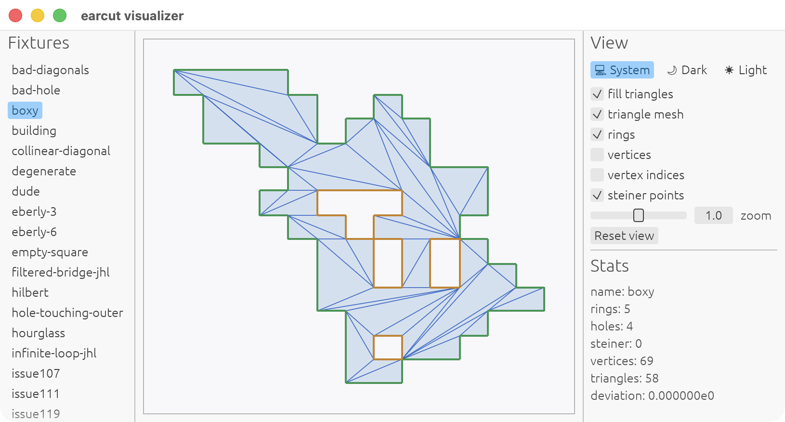

# earcut (Rust)

[](https://github.com/georust/earcut/actions/workflows/ci.yml)
[](https://codecov.io/gh/georust/earcut)
[](https://crates.io/crates/earcut)

A Rust port of the [mapbox/earcut](https://github.com/mapbox/earcut) polygon triangulation library.

- Based on the latest earcut 3.0.2 release.
- Designed to avoid unnecessary memory allocations. Internal buffers and the output index vector can be reused across multiple triangulations.
- Also provides `earcut::int::EarcutI32` for integer coordinates with exact integer predicates, but it can be slower than the float-based `Earcut` on modern CPUs.
- An additional helper, `utils3d::project3d_to_2d`, projects coplanar 3D polygons onto a 2D plane for use with earcut.

<p align="center">

</p>


## Benchmarks

Time per iteration (smaller is better). Measured on a MacBook Pro (M1 Pro).

| Polygon      | earcut.hpp (C++) | earcut (Rust) |
|--------------|-----------------:|--------------:|
| bad_hole     |        3.53 µs/i |    2.712 µs/i |
| building     |         351 ns/i |      157 ns/i |
| degenerate   |         153 ns/i |       41 ns/i |
| dude         |        5.21 µs/i |    4.204 µs/i |
| empty_square |         201 ns/i |       67 ns/i |
| water        |         420 µs/i |    345.8 µs/i |
| water2       |         338 µs/i |    249.7 µs/i |
| water3       |        13.5 µs/i |    11.91 µs/i |
| water3b      |        1.27 µs/i |    1.087 µs/i |
| water4       |        88.9 µs/i |    67.40 µs/i |
| water_huge   |       6.674 ms/i |    7.059 ms/i |
| water_huge2  |       15.23 ms/i |    14.82 ms/i |

Note: [earcut.hpp](https://github.com/mapbox/earcut.hpp) has not fully caught up with the latest [mapbox/earcut](https://github.com/mapbox/earcut).

## Demo

A simple egui-based visualizer for inspecting how earcut works.

```bash
cargo run --example visualizer
```

<p align="center">

</p>

## License

Licensed under either the MIT License ([LICENSE-MIT](LICENSE-MIT)) or the Apache License 2.0 ([LICENSE-APACHE](LICENSE-APACHE)) at your option.

This project contains portions derived from [mapbox/earcut](https://github.com/mapbox/earcut), originally distributed under the ISC License ([LICENSE-ISC](LICENSE-ISC)).
